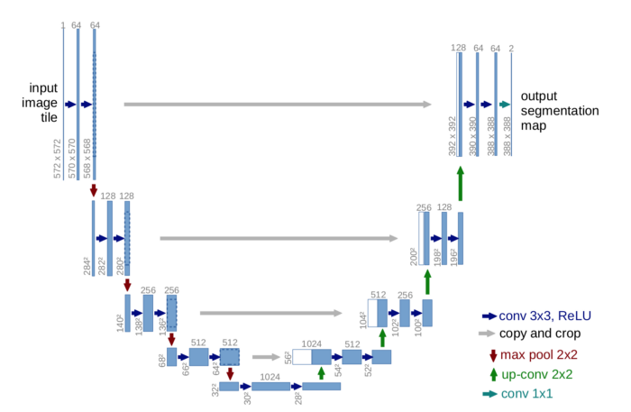

# U-net_for_Multiclass_Segmentation

UNET PAPER: <link>https://arxiv.org/abs/1505.04597</link>

<b>U-Net Architecture</b>
The architecture follows ‘U’ shaped path. It is a unit network architecture which is built upon the fully connected network in CNN.
 
</img>
 
I have used the Oxford IIIT Pet dataset, which consists of three classes:
1. Main object (Cat or Dog)
2. Border
3. Background
 
<b>Dataset:</b><a href="https://www.youtube.com/redirect?event=video_description&redir_token=QUFFLUhqbmNEbDd3RTZKQnRuM25ibXlfT1k0ZzRuM1JDUXxBQ3Jtc0tsRHZCN0RCbXJMVWFBLTBuVEdQNUNmNV9aTkZVN0NzQ1N2ZS0wOVdKN1BReGxxbnRIcGptWENTQXV3VFVCbDRUOHFfRXk4bjlBNVpjVHNNOVNZLWJhcVlHTGVZcTZBUXBaVWxzNzhUVEl5UXE4eE9vNA&q=https%3A%2F%2Fwww.robots.ox.ac.uk%2F%7Evgg%2Fdata%2Fpets"> Oxford IIIT Pet dataset</a>
